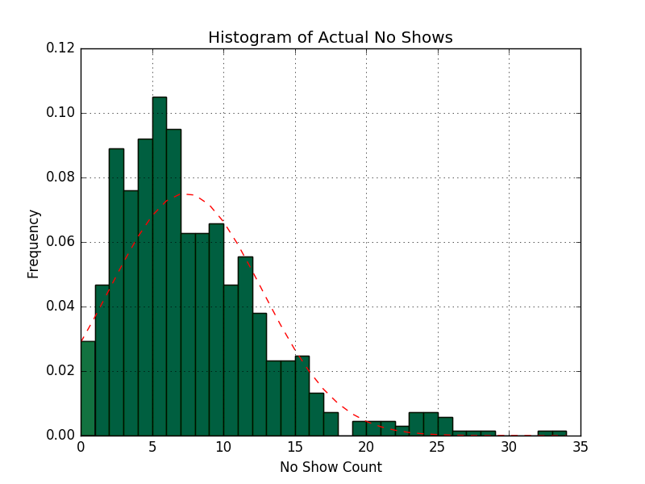
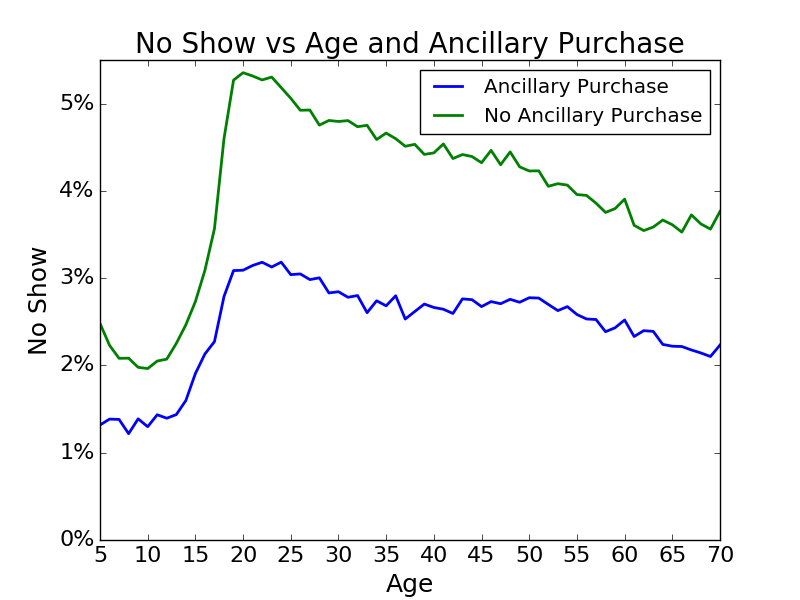

## Personal Background

During my time as an operations research analyst at Frontier Airlines, I had access to a lot of data,
that I could not fully take advantage of.  This is what motivated me to study Data Science at Galvanize.

One of the problems in particular that I took interest in was how to use passenger level data to determine the optimal overbooking level for a given upcoming flight.

## Overview

Anytime a flight takes off with an empty seat due to a passenger not showing up for their flight (no show), the airline looses potential revenue, because an extra seat could have been sold.  The objective of this project is to discover how to recover some of this potential revenue, without bumping too many passengers.

It is believed that data on individual passengers (Age, Advanced Purchase, Ancillary Purchase,ect) can be used to estimate their probability of missing their flight.

In the event that an airline overbooks too much, and passengers have to be bumped, passengers will first be offered compansation in the form of airline flight vouchers to take a later flight.  Thus, a passenger that volunerally takes this compansation would be happier than had they taken the original flight.

## Current Method

In the current method, previous flights are looked at and the no show rate for the bottom 10th quartile is used for the overbooking rate.

Flights without historical information would not be overbooked.

Passengers who missed their original flights but were rebooked on later flights would not be considered no shows.

## EDA

Looking at the histogram below, it can be seen that there is a lot of space to book more passengers.

If we combine the age of a passenger, and whether or not they purchase an ancillary item, we get the below graph.  The graph below shows that passengers that purchase ancillary items are more likely to show up for there flight than those who do not.  It also appears that 10 year olds are the most likely to make a flight, while 20 year olds are the least likely.

## Features

For this study the following features were pulled for a one year period for Frontier Airlines.  Please note, a passenger that pays for an ancillary item pays in advance to check a bag or have a seat assignment.  It is assumed that someone that pays in advance for such a product is more intent on actually traveling.

| Feature Name | Description |
| ------------ |:------------------------:|
| Age | Passenger Age |
| AP | Days in advance the ticket was purchased |
| PAX | The number of passengers on a reservation |
| Ancillary | Was an ancillary item purchased at time of booking (y/n) |
| Ticket Revenue | Cost of ticket |
| Flight Type | Type of flight market, International, Vegas,... |
| Flight Hour | Hour of the day that the flight departs |
|  |  |

## Model

After running the model with Logisitic Regression and Random Forests, the Logistic Regression Model proved to be better at matching the training data.  It turns out that passenger age did not have a significant impact on a passengers probability of no showing for a flight, because the real factor was how many passengers were traveling together.  Passengers traveling alone were much more likely to miss a flight.

Logistic Regression was used to determine a P-value for each passenger on a flight to no show.  Then, with resampling, it became possible to get a confidence interval for the number of noshows for a flight.  The model then used a 95% confidence interval to protect against bumping passengers.

## Flight Level Results

If we look at two flights, one of which had zero no shows, and the other which had two, the usefulness of the model can be shown.
#### Flight 86: St Louis to Cancun

| 4/21 | 4/28 |
| ------------ |:------------------------:|
| 0 no shows predicted | 1 no show predicted |
| 0 actual no shows | 2 actual no shows |

[logo]: https://github.com/JohnSteffan/AirlineOverbookingCalculator/tree/master/Figs/EngineerAge.png "text1"

## Overall Results

For this example, January to March 2016 data was used to predict April 2016 no shows.  The acutall no shows for April 2016 were then compared to the two model predictions.

In April 2016 there were a total of 28,252 no shows, which gives plenty of space for additional revenue.

Assuming $75 in additional revenue, and a $200 cost for bumping a passenger,

| | Current System | Logistic Regression |
| ------------ |:------------------------:|:------------------------:|
| Increased Passengers | 2,005 | 6,492 |
| Bumped Passengers | 111 | 505 |
| Additional Revenue | $128,175 | $385,900 |

The above table shows that using the Logistic Regression would result in 394 additional passengers being bumped, but would lead to over $250,000 in additional revenue for the month of April.
